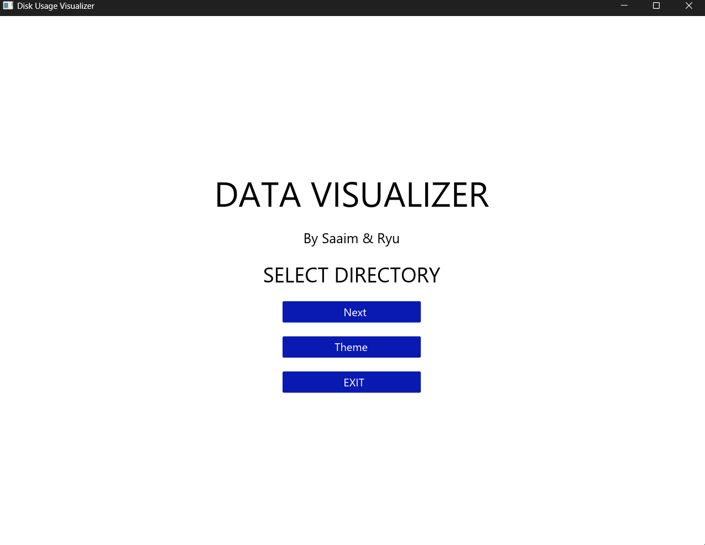
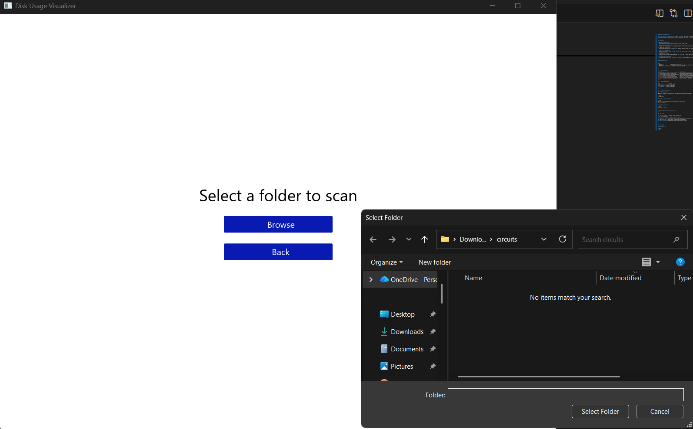
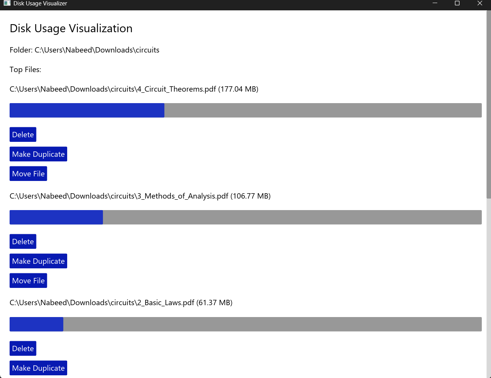
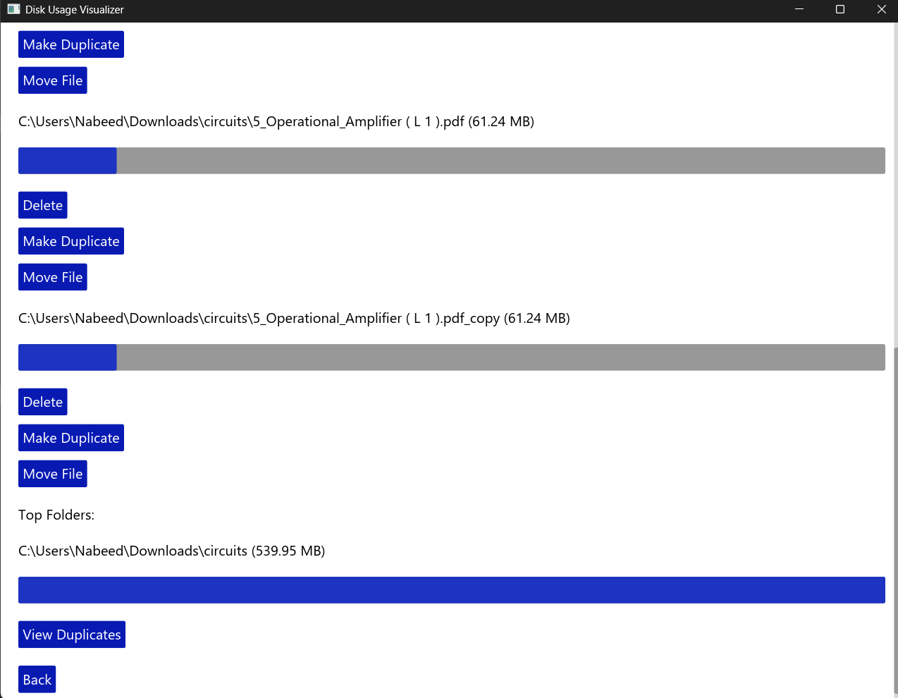
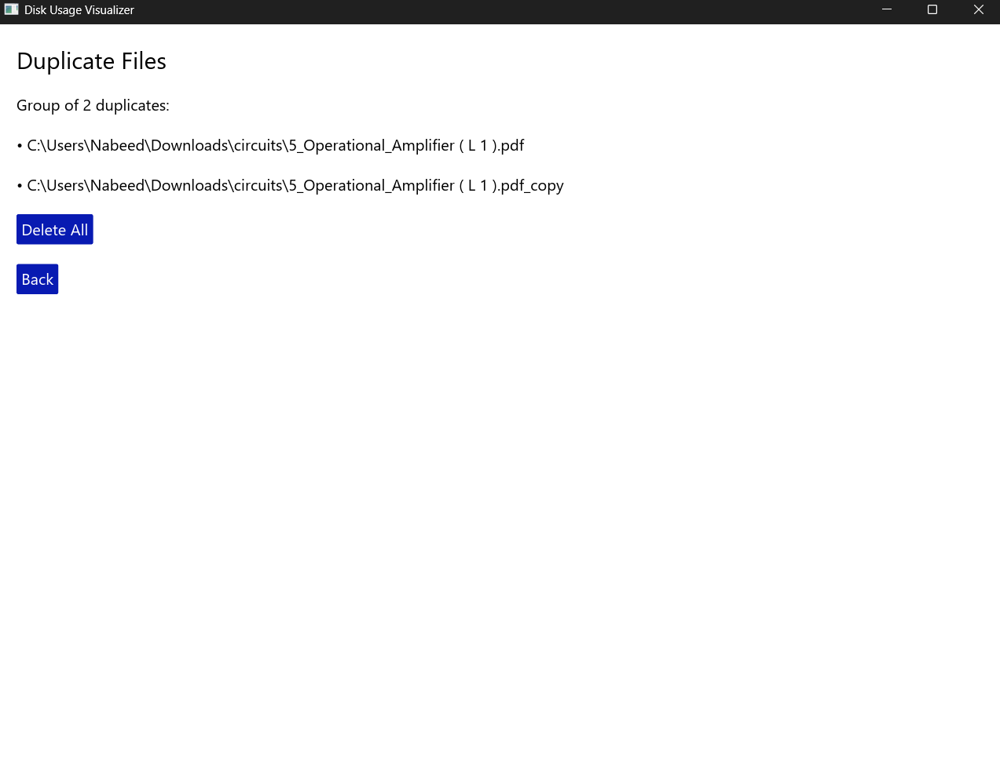

# 🧭 Disk Usage Visualizer

A **cross-platform desktop application** built in **Rust** that scans directories, visualizes disk usage, detects duplicate files, and lets users manage (delete, move, or duplicate) their files — all through a clean **Iced GUI** interface.

---

## ✨ Features

* 📁 **Folder Scanning:**
  Recursively scans directories to calculate file and folder sizes.

*  **Disk Visualization:**
  Displays top files and folders using progress bars for intuitive size comparison.

*  **Duplicate Detection:**
  Uses cryptographic hashing (**BLAKE3**) to identify identical files even if they have different names.

*  **Safe File Management:**
  Delete, move, or make copies of files directly from the interface — safely moves deleted files to the system trash instead of permanent deletion.

*  **Native File Picker:**
  Integrated native folder selection dialogs via **rfd** for a smooth, OS-consistent user experience.

*  **Asynchronous Scanning:**
  Uses asynchronous operations to prevent UI blocking while scanning large directories.

---

## Project Structure

```
src/
 ├── main.rs               # Application entry point
 └── app.rs                # Iced-based GUI logic (screens, buttons, layout), Folder scanning and aggregation logic, File hashing and duplicate detection, File operations (move, copy, delete)
```

---

## ⚙️ Core Dependencies

| **Crate**                                     | **Purpose**                                          |
| --------------------------------------------- | ---------------------------------------------------- |
| [`iced`](https://crates.io/crates/iced)       | Cross-platform GUI framework for Rust                |
| [`walkdir`](https://crates.io/crates/walkdir) | Efficient recursive directory traversal              |
| [`rfd`](https://crates.io/crates/rfd)         | Native file/folder picker dialogs                    |
| [`trash`](https://crates.io/crates/trash)     | Move files to recycle bin safely                     |
| [`blake3`](https://crates.io/crates/blake3)   | Fast and secure file hashing for duplicate detection |
| [`tokio`](https://crates.io/crates/tokio)     | Async runtime for background operations              |

---

## 💻 Supported Platforms

| OS             |       Status      |
| :------------- | :---------------: |
| 🐧 **Linux**   | ✅ Fully supported |
| 🪟 **Windows** | ✅ Fully supported |
| 🍎 **macOS**   | ✅ Fully supported |

---

## 🚀 Installation & Running

### ** Prerequisites**

Make sure you have [Rust](https://www.rust-lang.org/tools/install) installed:

```bash
rustup update
```

### ** Clone the Repository**

```bash
git clone https://github.com/yourusername/disk-visualizer.git
cd disk-visualizer
```

### ** Build and Run**

```bash
cargo run --release
```

This will launch the **GUI application**.

---

##  How to Use

1. **Launch the app** → The Home Screen welcomes you.

2. **Select Directory** → Choose a folder to scan.

3. **Visualize Results** → View largest files and folders with progress bars.

4. **Manage Files** → Delete, move, or duplicate files directly.

5. **View Duplicates** → Detect and remove identical files safely.


---


## 👥 Authors

**Developed by:**

* Saaim
* Ryu
